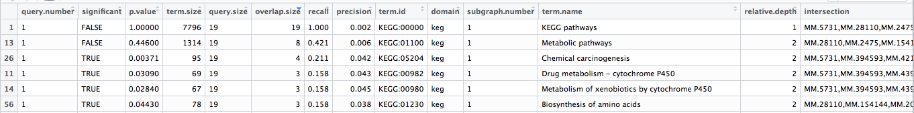

# CAGE Analysis

## Heatmap

[R markdown](CAGE_heatmap.Rmd)

## Tissue-specific

I used Python to determine tissue-specific promoters based on:

- [Threshold on Scaled TPMs](CAGE_threshold.py)
    -   [Visualisation of Scaled TPMs](CAGE_viz.py)
        -   [before scaling](out/before-scaling.png)
        -   [after scaling](out/after-scaling.png)
- [t-test](CAGE_t_test.py)

Then, export the result to R for retrieving GENE IDs and GO analysis.

[R markdown](CAGE_GO.Rmd)

Example result from liver-specific promoters defined by t-test

The result is ranked by the number of genes shared the same KEGG term.
