Homework 1
================

`gene_lengths_v2.txt` shows lengths of genes and more for all human genes from the refseq database, covered next week. It has four columns:

1.  `name` \#The gene ID/name
2.  `genome_length` \#The total length in nucleotides that this gene cover on the genome \#(exons + introns)
3.  `mrna_length` \#The total length of all the exons of the gene combined (but not introns)
4.  `exons` \#The number of exons for the gene

In this homework, we will try to figure out what the difference is between these, and what the most extreme genes are.

0. Load the dataset
-------------------

The given file has a header row, so we need to specify this in the function to load the dataset correctly.
The dataset is stored as a dataframe `genes_df`.
To get the sense of what we are dealing with, we use `summary` to get summary statistics of each column in the dataframe `genes_df`.

``` r
genes_df <- read.table("gene_lengths_v2.txt", header=TRUE)
summary(genes_df)
```

    ##       name        mrna_length    genome_length       exon_count    
    ##  15E1.2 :    1   Min.   :  146   Min.   :    146   Min.   :  1.00  
    ##  2'-PDE :    1   1st Qu.: 1531   1st Qu.:   7326   1st Qu.:  4.00  
    ##  76P    :    1   Median : 2374   Median :  21115   Median :  8.00  
    ##  7A5    :    1   Mean   : 2867   Mean   :  54840   Mean   : 10.13  
    ##  A1BG   :    1   3rd Qu.: 3609   3rd Qu.:  56074   3rd Qu.: 13.00  
    ##  A2BP1  :    1   Max.   :43815   Max.   :2304634   Max.   :149.00  
    ##  (Other):18483

1. The most common number of exons
----------------------------------

*Make a histogram that shows what the typical number of exons is. Adjust the bins so that we can pinpoint exactly what number of exons that is the most common. Comment the plot.*

``` r
hist(genes_df$exon_count, 
     breaks = max(genes_df$exon_count), 
     main = "Histogram of the numbers of exons in a gene for the whole dataset")
```

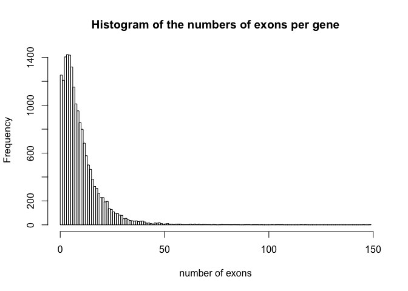

``` r
hist(genes_df$exon_count[genes_df$exon_count<50], 
     breaks = max(genes_df$exon_count[genes_df$exon_count<50]))
```

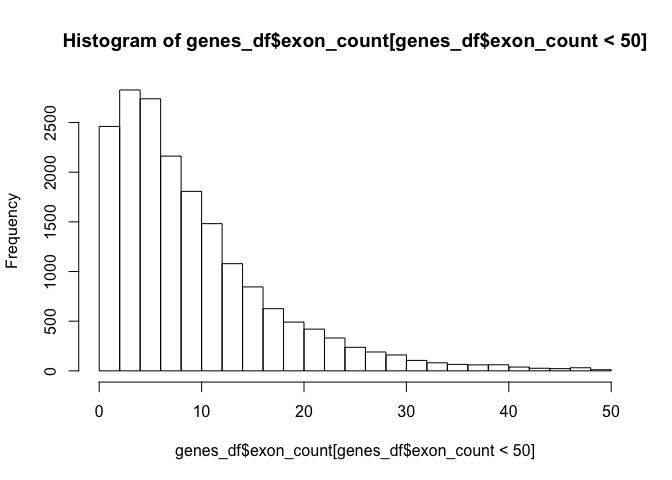

``` r
# from https://www.tutorialspoint.com/r/r_mean_median_mode.htm
getmode <- function(v) {
   uniqv <- unique(v)
   uniqv[which.max(tabulate(match(v, uniqv)))]
}

getmode(genes_df$exon_count)
```

    ## [1] 4

2. Total length of introns
--------------------------

*Add an additional column to the dataframe that contains the total length of introns for each gene*

``` r
genes_df$intron_length <- genes_df$genome_length - genes_df$mrna_length
summary(genes_df$intron_length)
```

    ##    Min. 1st Qu.  Median    Mean 3rd Qu.    Max. 
    ##       0    5227   18420   51970   52390 2295000

3. The length of total exon and total intron
--------------------------------------------

*Make histograms and boxplots showing the distribution of total exon and total intron lengths, all as subplots in the same larger plot, where each dataset have a different color. On the histograms, the number of bins should be exactly the same, and the x-axis should have the same scale.* *Comment the plot – are exons larger than introns or vice versa?*

``` r
hist(genes_df$intron_length, 
     col=rgb(1,0,0,0.5), 
     breaks = 50, 
     main="The length of total exon (blue) and total intron (red)", xlab="length")
hist(genes_df$mrna_length, 
     col=rgb(0,0,1,0.5), 
     breaks = 25, 
     add=TRUE)
```

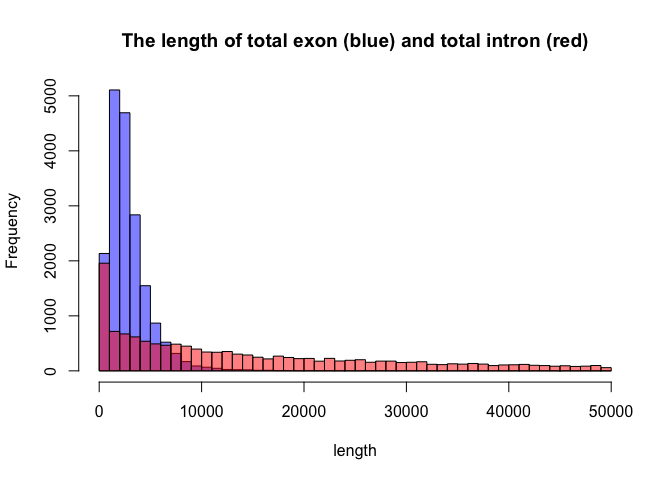

Most of the introns are enormously larger than exons.

Visualise the distribution of those less than 100,000 bp in length.

``` r
hist(genes_df$intron_length[genes_df$intron_length<100000], 
     col=rgb(1,0,0,0.5), 
     breaks = 50, 
     ylim = c(0,8000), 
     main="The length of total exon (blue) and total intron (red)", xlab="length")
hist(genes_df$mrna_length[genes_df$mrna_length<100000], 
     col=rgb(0,0,1,0.5), 
     breaks = 25, 
     add=TRUE)
```

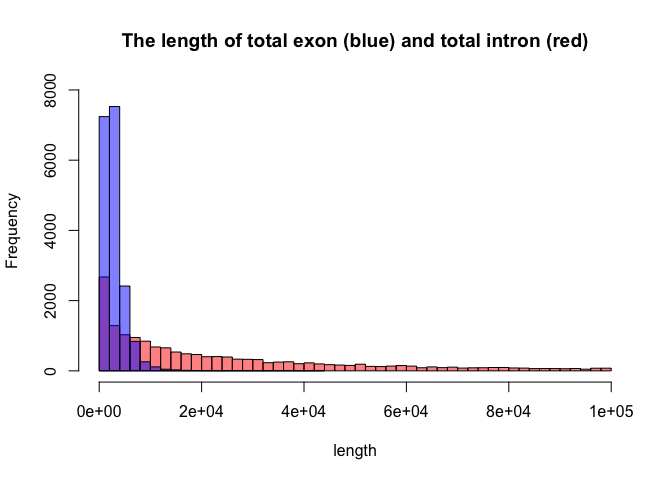

4. Hypothesis testing
=====================

\*Are the mRNA lengths significantly longer than the total intron lengths, or is it the other way around?

**H0:** the mRNA lengths are equal to or longer than the total intron lengths **H1:** The mRNA lengths significantly shorter than the total intron lengths.

``` r
boxplot(cbind(genes_df$mrna_length, genes_df$intron_length))
```

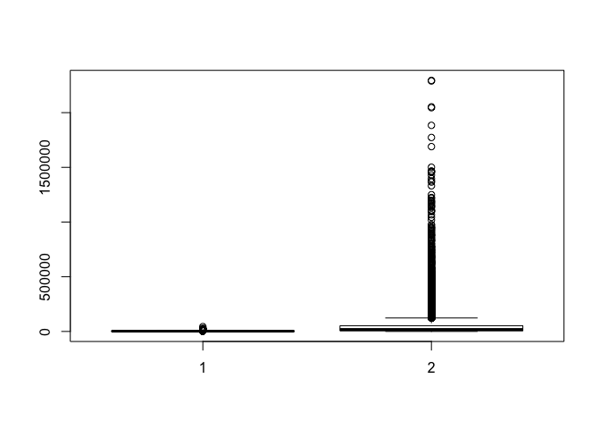

``` r
boxplot(genes_df$mrna_length)
```

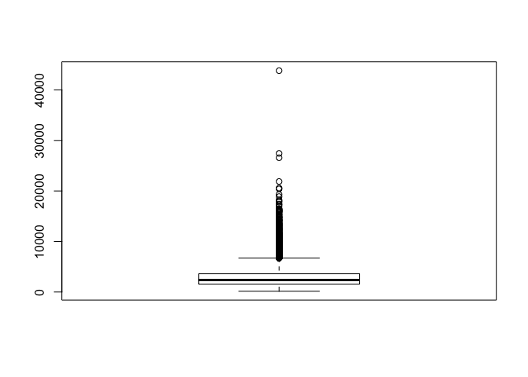

*test normality*

``` r
par(mfrow = c(1,2))
qqnorm(genes_df$mrna_length, main="exon length")
qqline(genes_df$mrna_length, col="red")

qqnorm(genes_df$intron_length, main="intron length")
qqline(genes_df$intron_length, col="red")
```

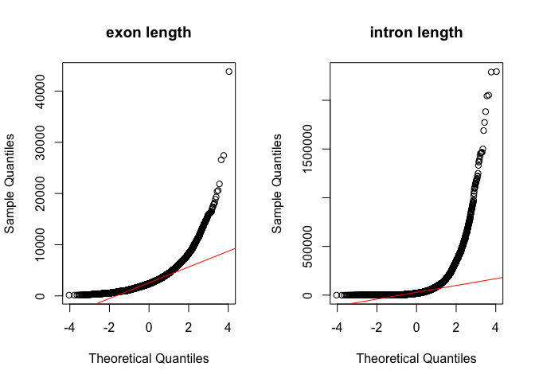

They deviate a lot from normality, so we can't use parametric t-test.

``` r
wilcox.test(genes_df$exon_count, genes_df$intron_length, alternative="less")
```

    ## 
    ##  Wilcoxon rank sum test with continuity correction
    ## 
    ## data:  genes_df$exon_count and genes_df$intron_length
    ## W = 23160000, p-value < 2.2e-16
    ## alternative hypothesis: true location shift is less than 0

5. Correlation
--------------

*Continuing on the same question: is the total exon length more correlated to the total intron length than the number of exons? Show this both with a plot and with correlation scores. Comment on your result.*

``` r
exonL_intronL = lm(mrna_length ~ intron_length, data = genes_df)
exonL_exonN = lm(mrna_length ~ exon_count, data = genes_df)


plot(mrna_length ~ intron_length, data = genes_df)
abline(exonL_intronL, col="red")
```

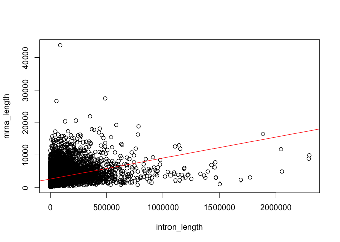

``` r
plot(mrna_length ~ exon_count, data = genes_df)
abline(exonL_exonN, col="red")
```

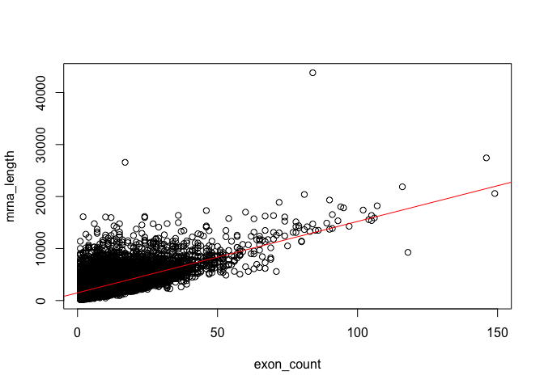

``` r
summary(exonL_intronL)
```

    ## 
    ## Call:
    ## lm(formula = mrna_length ~ intron_length, data = genes_df)
    ## 
    ## Residuals:
    ##    Min     1Q Median     3Q    Max 
    ## -11257  -1216   -410    717  40708 
    ## 
    ## Coefficients:
    ##                Estimate Std. Error t value Pr(>|t|)    
    ## (Intercept)   2.529e+03  1.560e+01  162.08   <2e-16 ***
    ## intron_length 6.517e-03  1.294e-04   50.36   <2e-16 ***
    ## ---
    ## Signif. codes:  0 '***' 0.001 '**' 0.01 '*' 0.05 '.' 0.1 ' ' 1
    ## 
    ## Residual standard error: 1914 on 18487 degrees of freedom
    ## Multiple R-squared:  0.1206, Adjusted R-squared:  0.1206 
    ## F-statistic:  2536 on 1 and 18487 DF,  p-value: < 2.2e-16

``` r
par(mfrow=c(2,2))
plot(exonL_intronL)
```

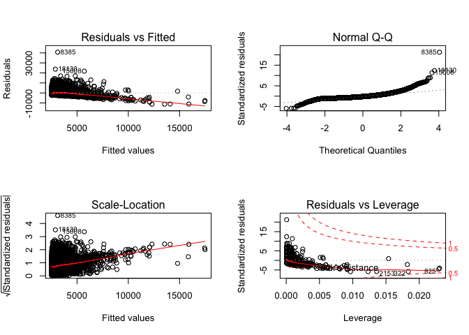

``` r
summary(exonL_exonN)
```

    ## 
    ## Call:
    ## lm(formula = mrna_length ~ exon_count, data = genes_df)
    ## 
    ## Residuals:
    ##     Min      1Q  Median      3Q     Max 
    ## -8425.0 -1044.0  -407.6   617.4 30799.9 
    ## 
    ## Coefficients:
    ##             Estimate Std. Error t value Pr(>|t|)    
    ## (Intercept) 1475.206     16.887   87.36   <2e-16 ***
    ## exon_count   137.380      1.216  112.96   <2e-16 ***
    ## ---
    ## Signif. codes:  0 '***' 0.001 '**' 0.01 '*' 0.05 '.' 0.1 ' ' 1
    ## 
    ## Residual standard error: 1570 on 18487 degrees of freedom
    ## Multiple R-squared:  0.4084, Adjusted R-squared:  0.4083 
    ## F-statistic: 1.276e+04 on 1 and 18487 DF,  p-value: < 2.2e-16

``` r
plot(exonL_exonN)
```

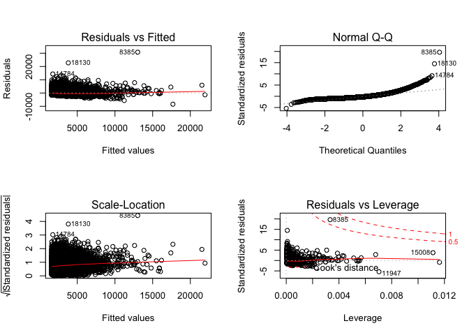

6. Longest total exon length
============================

*What gene has the longest (total) exon length? How long is this mRNA and how many exons does it have? Do this in a single line of R (without using “;”).*

``` r
genes_df[genes_df$mrna_length == max(genes_df$mrna_length), ]
```

    ##       name mrna_length genome_length exon_count intron_length
    ## 8385 MUC16       43815        132498         84         88683

7. Extremes removal
===================

*In genomics, we often want to fish out extreme examples – like all very short genes, or all very long genes. It is often helpful to make a function to do these tasks – it saves time in the long run.*

*Make a function called “count\_genes” that takes two inputs: a. A vector with mRNA lengths b. A cutoff x1 which by default should be set to 0 c. A cutoff x2 which by default should be set to the longest (total) mrna length of the input vector, as you did in “6)”. d. Then, the function should count the number of mRNAs that are no less than (&lt;=) x2 but larger than (&gt;) x1; and finally return the fraction of this count over the total count of mRNAs.*

``` r
longest_mrna <- max(genes_df$mrna_length)
count_genes <- function(mrna_length_vec, x1=0, x2=longest_mrna){
  # If both comparisons are true, it will return 1. Do this for all genes and get the sum. 
  count <- sum((x1 < mrna_length_vec) & (mrna_length_vec <= x2))
  fraction <- count/length(mrna_length_vec)
  return(fraction)
}
```

*Test this function with the mRNA lengths using the the five settings below: i) Using the default of x1 and x2; ii) Using the default of x2 and set x1=10000; iii) x1=1000 and x2=10000; iv) x1=100 and x2=1000; v) x1=0 and x2=100.*

``` r
fractions <- c()
fractions[1] <- count_genes(genes_df$mrna_length)
fractions[2] <- count_genes(genes_df$mrna_length, x1=10000)
fractions[3] <- count_genes(genes_df$mrna_length, x1=1000, x2=10000)
fractions[4] <- count_genes(genes_df$mrna_length, x1=100, x2=1000)
fractions[5] <- count_genes(genes_df$mrna_length, x1=0, x2=100)

fractions
```

    ## [1] 1.00000000 0.01130402 0.87327600 0.11541998 0.00000000
